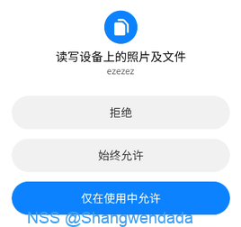

# NSSCTF三周年Mobile题

> Problem: [[NSSCTF 3rd]链接](https://www.nssctf.cn/problem/5747)

[[toc]]

## 思路

使用frida dump so文件，分析真正的so，破解密文

**注意**

本题采用自定义linker加固So，【模板来自于ngiokweng师傅】链接地址：https://bbs.kanxue.com/thread-282316.htm

注意init段执行了修改函数，此点也可以发现于Hook上的registerNative并不是你在Jni_Onload中发现的

注意由于是linker加固的SO Elfhander中部分信息被抹去，需要自行恢复

后面发现对密文处理就是一个异或，没啥好讲的~


## 解题步骤

### 能正常运行APP解题步骤
首先打开APP有一个权限申请必须同意不然无法运行

发现加载的so


但是似乎是混淆的，根据a方法和枚举module都可以发现真正的so，直接hook register 的时机dump下来
注意一下antifrida


这里dump的是linker之后的so，所以过滤一下MainActivity
``` JavaScript
function antiFrida() {
    var memcmp_addr = Module.findExportByName("libc.so", "fread");
    if (memcmp_addr !== null) {
        Interceptor.attach(memcmp_addr, {
            onEnter: function (args) {
                this.buffer = args[0];
                this.size = args[1];
                this.count = args[2]; 
                this.stream = args[3]; 
            },
            onLeave: function (retval) {
                if (this.count.toInt32() == 8) {
                    Memory.writeByteArray(this.buffer, [0x50, 0x00, 0x00, 0x58, 0x00, 0x02, 0x1f, 0xd6]);
                    retval.replace(8);
                }
            }
        });
    } else {
        console.error("Error: memcmp function not found in libc.so");
    }
}
function hook_RegisterNatives() {
    antiFrida();
    var symbols = Module.enumerateSymbolsSync("libart.so");
    var addrRegisterNatives = null;
    for (var i = 0; i < symbols.length; i++) {
        var symbol = symbols[i];

        //_ZN3art3JNI15RegisterNativesEP7_JNIEnvP7_jclassPK15JNINativeMethodi
        if (symbol.name.indexOf("art") >= 0 &&
            symbol.name.indexOf("JNI") >= 0 &&
            symbol.name.indexOf("RegisterNatives") >= 0 &&
            symbol.name.indexOf("CheckJNI") < 0) {
            addrRegisterNatives = symbol.address;
            console.log("RegisterNatives is at ", symbol.address, symbol.name);
        }
    }

    if (addrRegisterNatives != null) {
        Interceptor.attach(addrRegisterNatives, {
            onEnter: function (args) {
                console.log("[RegisterNatives] method_count:", args[3]);
                var env = args[0];
                var java_class = args[1];
                var class_name = Java.vm.tryGetEnv().getClassName(java_class);
                //console.log(class_name);

                var methods_ptr = ptr(args[2]);

                var method_count = parseInt(args[3]);
                for (var i = 0; i < method_count; i++) {
                    var name_ptr = Memory.readPointer(methods_ptr.add(i * Process.pointerSize * 3));
                    var sig_ptr = Memory.readPointer(methods_ptr.add(i * Process.pointerSize * 3 + Process.pointerSize));
                    var fnPtr_ptr = Memory.readPointer(methods_ptr.add(i * Process.pointerSize * 3 + Process.pointerSize * 2));

                    var name = Memory.readCString(name_ptr);
                    var sig = Memory.readCString(sig_ptr);
                    var find_module = Process.findModuleByAddress(fnPtr_ptr);
                    console.log("[RegisterNatives] java_class:", class_name, "name:", name, "sig:", sig, "fnPtr:", fnPtr_ptr, "module_name:", find_module.name, "module_base:", find_module.base, "offset:", ptr(fnPtr_ptr).sub(find_module.base));
                    if (class_name.indexOf("MainActivity") != -1) {
                        dump_so("libezezez83.so");
                    }
                }
            }
        });
    }
}

function dump_so(so_name) {
    var libso = Process.getModuleByName(so_name);
    console.log("[name]:", libso.name);
    console.log("[base]:", libso.base);
    console.log("[size]:", ptr(libso.size));
    console.log("[path]:", libso.path);
    var file_path = "/data/data/com.swdd.ezezez/" + libso.name + "_" + libso.base + "_" + ptr(libso.size) + ".so";
    var file_handle = new File(file_path, "wb");
    if (file_handle && file_handle != null) {
        Memory.protect(ptr(libso.base), libso.size, 'rwx');
        var libso_buffer = ptr(libso.base).readByteArray(libso.size);
        file_handle.write(libso_buffer);
        file_handle.flush();
        file_handle.close();
        console.log("[dump]:", file_path);
    }

}

setImmediate(hook_RegisterNatives);


```
接下来修复ELF头
反编译发现就是一个异或
值得注意的是真实的注册地址和你看到的不一样


### 无法正常运行APP解题步骤

部分手机可能无法运行APP，首先还是注意到Stub类：

可以发现在loadLibrary的时候加入了一个a方法

a方法修改真正载入的SO为libezezez83,所以我们对此进行分析
值得注意的是


这里找到的check是错的，是ezeze而不是ezezez所以考虑动态注册


分析动态注册的方法可以发现载入了静态资源路径是file/Data


使用loader加载了他

注意loading函数

所有字节异或0x5c,这就是对Data的解密操作


完成linker之后就进行链接操作了
那么我们就需要解密这个so文件了
之前分析了是0x5c异或，我们异或回去就好了
弄好之后注意文件头的修复

修复完毕后进行反编译

查看注册的方法
就可以发现是给MainAcitivity注册了，那么这个时候离成功就不远了，


看到注册的方法居然是空的，这是为什么呢
在linker中运行了init段

对35820引用就可以发现Gen函数

真正的check函数就在这里了

密文位置加密就是异或0xff


## EXP


## 总结
* 自定义Linker加固so